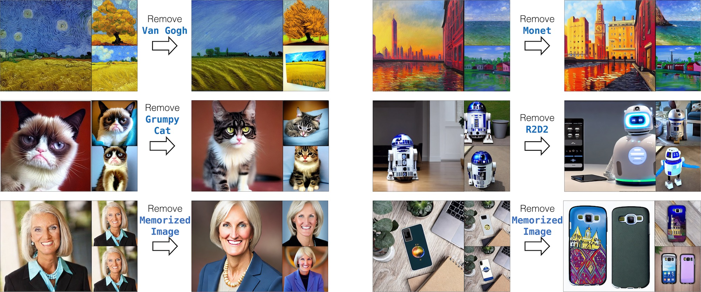

# Concept Ablation

### [website](https://www.cs.cmu.edu/~concept-ablation/)  | [paper](https://arxiv.org/abs/2303.13516) 

<br>
<div class="gif">
<p align="center">

</p>
</div>

Large-scale text-to-image diffusion models can generate high-fidelity images with powerful compositional ability. However, these models are typically trained on an enormous amount of Internet data, often containing copyrighted material, licensed images, and personal photos. Furthermore, they have been found to replicate the style of various living artists or memorize exact training samples. How can we remove such copyrighted concepts or images without retraining the model from scratch?

We propose an efficient method of ablating concepts in the pretrained model, i.e., preventing the generation of a target concept. Our algorithm learns to match the image distribution for a given target style, instance, or text prompt we wish to ablate to the distribution corresponding to an anchor concept, e.g., Grumpy Cat to Cats.

***Ablating Concepts in Text-to-Image Diffusion Models*** <br>
[Nupur Kumari](https://nupurkmr9.github.io/), [Bingliang Zhang](https://zhangbingliang2019.github.io), [Sheng-Yu Wang](https://peterwang512.github.io), [Eli Shechtman](https://research.adobe.com/person/eli-shechtman/), [Richard Zhang](https://richzhang.github.io/), [Jun-Yan Zhu](https://www.cs.cmu.edu/~junyanz/)<br>


## Results

We show results of our method on various concept ablation tasks, including specific object instances, artistic styles, and memorized images. We can successfully ablate target concepts while minimally affecting closely related surrounding concepts that should be preserved (e.g., other cat breeds when ablating Grumpy Cat). All our results are based on fine-tuning [stable-diffusion-v1-4](https://huggingface.co/CompVis/stable-diffusion-v-1-4-original) model.

For more generations and comparisons, please refer to our [webpage](https://www.cs.cmu.edu/~concept-ablation/).


### Style Ablation
<p align="center">

</p>

### Instance Ablation
<p align="center">

</p>

### Memorized Image Ablation
<p align="center">

</p>

## Method Details


<div>
<p align="center">

</p>
</div>

Given a target concept **Grumpy Cat** to ablate and an anchor concept **Cat**, we fine-tune the model to have the same prediction given the target concept prompt **A cute little Grumpy Cat** as when the prompt is **A cute little cat**.

## Getting Started

```
cd concept-ablation
conda env create -f environment.yaml
conda activate ablate
mkdir data

mkdir assets/pretrained_models
cd assets/pretrained_models
wget https://huggingface.co/CompVis/stable-diffusion-v-1-4-original/resolve/main/sd-v1-4.ckpt    # Stable Diffusion
wget https://dl.fbaipublicfiles.com/sscd-copy-detection/sscd_imagenet_mixup.torchscript.pt       # SSCD (required when ablating memorized images)
```


**Ablated Models:** we provide our final models with cross-attention weights fien-tuning [here](https://www.cs.cmu.edu/~concept-ablation/models/). 
To sample images from provided models: 
```
python sample.py --ckpt assets/pretrained_models/sd-v1-4.ckpt --delta_ckpt {downloaded-file} --prompt {} --ddim_steps 100 --outdir {} --n_copies 10 
```

#### Training
 
**Style ablation**

```
python train.py -t --gpus 0,1 --concept_type style --caption_target  "van gogh" --prompts assets/finetune_prompts/painting.txt --name "vangogh_painting" --train_size 200
```

**Instance ablation**
```
python train.py -t --gpus 0,1 --concept_type object --caption_target  "cat+grumpy cat" --prompts assets/finetune_prompts/cat.txt --name "grumpy_cat" --train_size 200
```

**Memorized image ablation**
```
python train.py -t --gpus 0,1 --concept_type memorization --caption_target  "New Orleans House Galaxy Case" --prompts assets/finetune_prompts/orleans_mem.txt --name "orleans_galaxy_case" --mem_impath assets/mem_images/orleans.png --train_size 200
```

For each concept ablation, we first generate training images which can take some time. To ablate any new concept, we need to provide the following required details and modify the above training commands accordingly:

* `concept_type`: ['style', 'object', 'memorization'] (required)
* `caption_target`: concept to be removed (artist e.g. "van gogh" or instance e.g. "cat+grumpy cat" or memorization prompt e.g. "New Orleans House Galaxy Case" )
* `prompts`: path to anchor prompts 
* `name`: name of the experiment
* `mem_impath`: path to memorized image (required when concept_type='memorization')

Optional:

* `parameter_group`: ['full-weight', 'cross-attn', 'embedding'] (default: 'cross-attn')
* `loss_type_reverse`: the loss type for finetuning. ['model-based', 'noise-based'] (default: 'model-based')
* `resume-from-checkpoint-custom`: the checkpoint path of pretrained model
* `regularization`: store-true, add regularization loss
* `train_size`: number of generated images for finetuning (default: 1000)
* `train_max_steps`: overwrite max_steps in finetuning (default: 100 for style and object, 400 for memorization)
* `base_lr`: overwrite base learning rate (default: 2e-6 for style and object, 5e-7 for memorization)
* `save_freq`: checkpoint saving steps (default: 100)
* `logdir`: path where experiment is saved (default: logs)


#### Sampling

```
python sample.py --ckpt {} --from-file {} --ddim_steps 100 --outdir {} --n_copies 10 
```

* `ckpt`: the location to checkpoint path
* `from-file`: the path to prompts txt file
* `outdir`: the path to image directory
* `name`: the name used for `wandb` logging
* `n_copies`: the number of copies for each prompt


#### Evaluating

For model evaluation, we provide a script to compute CLIP score, CLIP accuracy, FID and KID to baseline model.

The scripts contain two seprate stages, **generation** and **evaluation**

**generation stage**

```
python evaluate.py --gpu 0,1 --root {} --filter {} --concept_type {} --caption_target {}  --outpkl {} --base_outpath {} --eval_json {}
```

* `root`: the location to root training folder which contains a folder called `checkpoints`
* `filter`: a regular expression to filter the checkpoint to evaluate (default: step_*.ckpt)

* `concept_type`: choose from ['style', 'object', 'memorization']
* `caption_target`: the target for ablated concept
* `outpkl`: the location to save evaluation results (default: metrics/evaluation.pkl)
* `base_outpath`: the path to the root of baseline generation for FID, KID.
* `eval_json`: the path to a formatted json file for evaluation metadata

Our baseline generations can be downloaded from [here](??) (/grogu/user/bingliaz/revf/code/assets/baseline_generation)

**evaluation stage**

```
python evaluate.py --gpu 0,1 --root {} --filter {} --concept_type {} --caption_target {}  --outpkl {} --base_outpath {} --eval_json {} --eval_stage True
```

same script with addtional parameter: `--eval_stage True`

**adding entries to eval_json file**

For customized concept, user has to mannually specify a **new entry** in eval_json file and put that to correct concept type

````
caption target:{
	target: caption target 
	anchor: caption anchor
	hard_negatives:[
		caption hard negative 1,
		caption hard negative 2,
		...
		caption hard negative m,
	]
}
````

