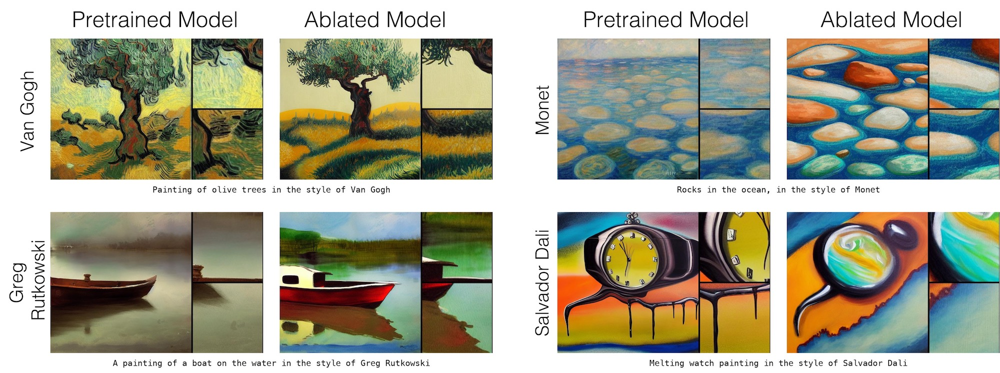
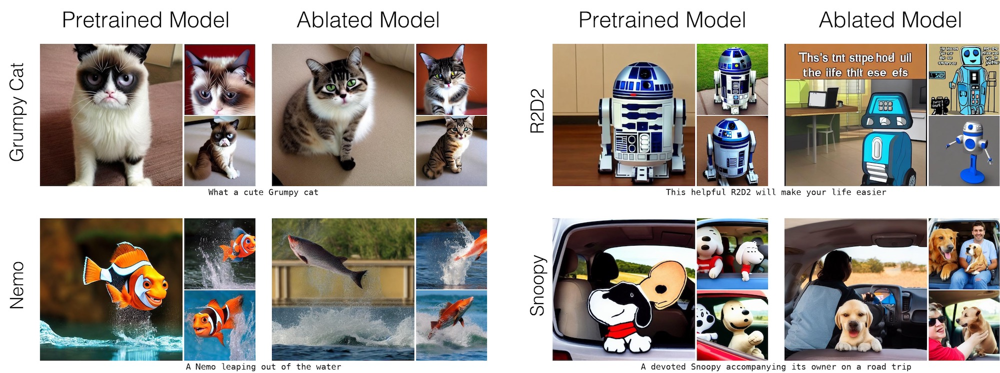
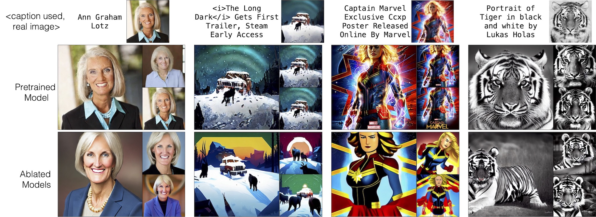
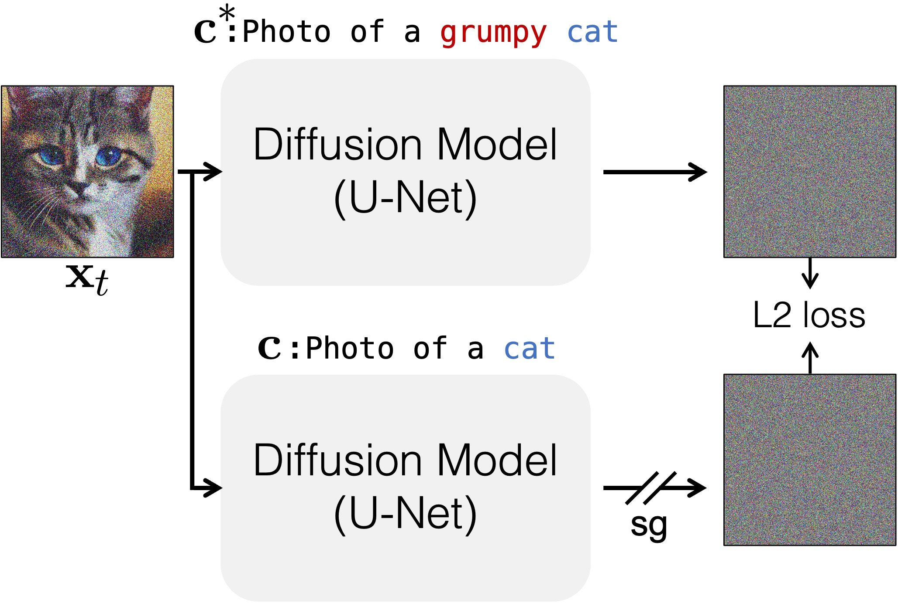

# Concept Ablation

### [website](https://www.cs.cmu.edu/~concept-ablation/)  | [paper](https://arxiv.org/abs/2303.13516) 

**[NEW!]** Huggingface demo [link](https://huggingface.co/spaces/nupurkmr9/concept-ablation). 

https://github.com/nupurkmr9/concept-ablation/assets/9297728/fb29bc97-a2a9-497a-bb8e-9ffb02986401


Our method can ablate (remove) copyrighted materials and memorized images from pretrained Stable Diffusion models. Here we change the target concept distribution to an anchor concept, e.g., Van Gogh painting to paintings or Grumpy cat to Cat.


***Ablating Concepts in Text-to-Image Diffusion Models*** <br>
[Nupur Kumari](https://nupurkmr9.github.io/), [Bingliang Zhang](https://zhangbingliang2019.github.io), [Sheng-Yu Wang](https://peterwang512.github.io), [Eli Shechtman](https://research.adobe.com/person/eli-shechtman/), [Richard Zhang](https://richzhang.github.io/), [Jun-Yan Zhu](https://www.cs.cmu.edu/~junyanz/)<br>
CMU, Tsinghua, Adobe <br>
ICCV, 2023

## Introduction
Large-scale text-to-image diffusion models can generate high-fidelity images with powerful compositional ability. However, these models are typically trained on an enormous amount of Internet data, often containing copyrighted material, licensed images, and personal photos. Furthermore, they have been found to replicate the style of various living artists or memorize exact training samples. How can we remove such copyrighted concepts or images without retraining the model from scratch?

We propose an efficient method of ablating concepts in the pretrained model, i.e., preventing the generation of a target concept. Our algorithm learns to match the image distribution for a given target style, instance, or text prompt we wish to ablate to the distribution corresponding to an anchor concept, e.g., Grumpy Cat to Cats.

## Results

Our method works well on various concept ablation tasks, including specific object instances, artistic styles, and memorized images. We can successfully ablate target concepts while minimally affecting closely-related surrounding concepts that should be preserved (e.g., other cat breeds when ablating Grumpy Cat). All our results are based on [stable-diffusion-v1-4](https://huggingface.co/CompVis/stable-diffusion-v-1-4-original) model.

For more generations and comparisons, please refer to our [webpage](https://www.cs.cmu.edu/~concept-ablation/).


### Style Ablation
We ablate different target artistic style concepts and generate normal paintings instead.

<p align="center">

</p>

### Instance Ablation
We ablate various instances and overwrite them with general category anchor concepts. 
<p align="center">

</p>

### Memorized Image Ablation
Our method can ablate memorized training images and instead generate variations. 

<p align="center">

</p>

## Method Details


<div>
<p align="center">

</p>
</div>

Given a target concept **Grumpy Cat** to ablate and an anchor concept **Cat**, we fine-tune the model to have the same prediction given the target concept prompt **A cute little Grumpy Cat** as when the prompt is **A cute little cat**.

## Getting Started 

**Diffusers**: Please refer [here](diffusers/README.md) for ablating concepts using diffusers based stable-diffusion model. 

**CompVis**: Please refer [here](compvis/README.md) for ablating concepts using CompVis based stable-diffusion model. 

Note: all our results in the paper were obtained using CompVis based implementation. 


## Citation
If you use this code for your research, please cite our paper.

```bibtex
@inproceedings{kumari2023conceptablation,
  author = {Kumari, Nupur and Zhang, Bingliang and Wang, Sheng-Yu and Shechtman, Eli and Zhang, Richard and Zhu, Jun-Yan},
  title = {Ablating Concepts in Text-to-Image Diffusion Models},
  booktitle = ICCV,
  year = {2023},
}
```
